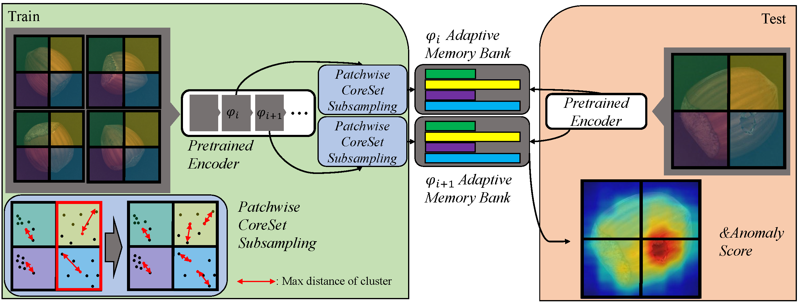

# FAPM_official
This repository contains the implementation of FAPM (2023 ICASSP).

https://arxiv.org/abs/2211.07381



The FAPM is proposed to find an anomaly industrial object. Our model is ranked #10 in MvTEC AD benchmark, and this result can be found in papers with code (https://paperswithcode.com/sota/anomaly-detection-on-mvtec-ad). 

## Future work

- [x] Inference Code
- [x] Pretrained Memory 
- [ ] Training Code 

## Development setup

conda environment
```sh
conda create -n FAPM
conda activate FAPM
pip install -r requiremnets.txt

```
## Dataset
Please download the MVTec dataset from this [website](https://www.mvtec.com/company/research/datasets/mvtec-ad).


## Usage

Inference Code
```sh
python test.py --category=capsule --n_neighbors=4
```
You can download [pretrained memory](https://drive.google.com/drive/folders/1z4dplHddceYLoYiKe29NY_SxeIJFstPu?usp=share_link) from this google link.

## Citation
Cite as below if you find this repository is helpful to your project:
'''sh
@article{kim2022fapm,
  title={FAPM: Fast Adaptive Patch Memory for Real-time Industrial Anomaly Detection},
  author={Kim, Donghyeong and Park, Chaewon and Cho, Suhwan and Lee, Sangyoun},
  journal={arXiv preprint arXiv:2211.07381},
  year={2022}
}
'''

## Acknowledgement

Some code snippets are borrowed from [PatchCore_anomaly_detection](https://github.com/hcw-00/PatchCore_anomaly_detection) and [patchcore-inspection](https://github.com/amazon-science/patchcore-inspection). Thanks for these great projects.

